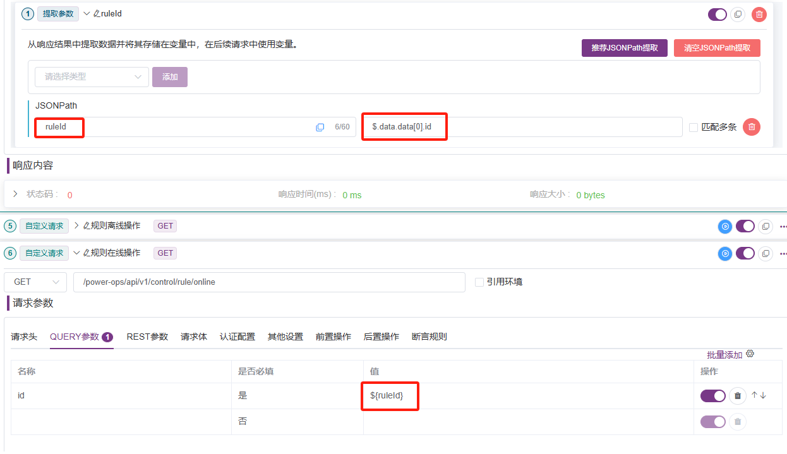
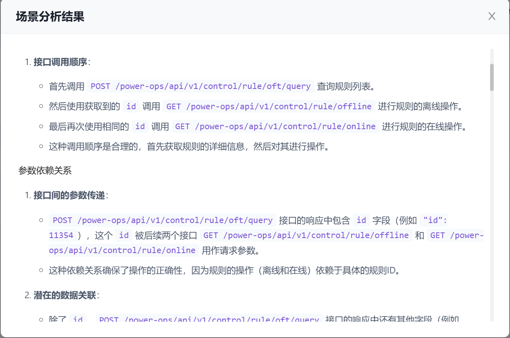
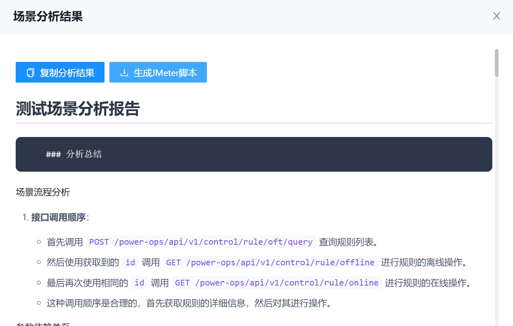

# U-Network 网络分析工具

<div align="center">
  
  
  [](https://chrome.google.com/webstore/detail/ajax-interceptor-tools/kphegobalneikdjnboeiheiklpbbhncm)
  [](https://chrome.google.com/webstore/detail/ajax-interceptor-tools/kphegobalneikdjnboeiheiklpbbhncm)
</div>

## 🌟 功能特点

### 1. 智能网络分析
- 实时监控和记录网络请求
- Deepseek驱动的场景分析和测试建议
- 自动识别接口依赖关系
- 智能参数提取和关联分析
- 深度异常分析和诊断
- 自动化测试用例生成

### 2. 高级请求管理
- 支持拦截和修改 XMLHttpRequest 和 fetch 请求
- 基于正则表达式的请求匹配
- 灵活的请求头和请求体修改
- 支持 404 状态请求的处理

### 3. 响应数据处理
- JSON/JavaScript 格式响应编辑
- Mock.js 语法支持
- 原始请求信息获取
- 灵活的数据模拟场景

### 4. 测试场景管理
- 一键保存测试场景
- AI 驱动的场景分析
- JMeter 脚本自动生成
- 完整的测试覆盖建议

### 5. 开发辅助功能
- 画中画配置界面
- 规则导入/导出
- 分组管理
- 快速请求拦截

## 📦 安装

### Chrome 应用商店安装
访问 [Chrome Web Store](https://chrome.google.com/webstore/detail/ajax-interceptor-tools/kphegobalneikdjnboeiheiklpbbhncm) 安装插件

### 手动安装
1. 下载 [最新版本](https://raw.githubusercontent.com/PengChen96/ajax-tools/master/kphegobalneikdjnboeiheiklpbbhncm.crx)
2. 打开 Chrome 扩展管理页面 (chrome://extensions/)
3. 将下载的 .crx 文件拖入浏览器完成安装

## 🚀 U-Network 面板详细说明

### 面板布局
1. 工具栏区域
   - 录制/暂停按钮：控制网络请求的监控
   - 清除按钮：一键清空当前记录
   - 导入/导出按钮：批量处理请求规则
   - 保存场景按钮：保存选中请求到测试场景
   - 生成脚本按钮：基于场景生成JMeter脚本
   - 搜索框：快速筛选目标请求

2. 请求列表区域
   - 请求URL和方法
   - 状态码和响应时间
   - 请求大小和类型
   - 快速操作按钮
     * 拦截按钮：快速添加拦截规则
     * 分析按钮：进入详细分析面板

3. 详细信息面板
   - 请求头：展示完整的请求头信息
   - 请求体：显示请求参数和数据
   - 响应体：展示响应数据，支持JSON格式化
   - AI异常分析：智能分析请求异常
   - AI接口分析：深度分析接口特征
   - AI用例生成：自动生成测试用例

### 核心功能说明

#### 1. 智能请求分析
- **实时监控**
  * 自动捕获页面所有AJAX和Fetch请求
  * 支持筛选特定类型的请求
  * 记录完整的请求响应信息

- **场景保存**
  * 选择多个相关请求组成测试场景
  * 自动分析请求间的依赖关系
  * 保存场景供后续分析和测试使用

#### 2. AI驱动的异常分析
- **深度异常诊断**
  * 自动识别错误类型和可能原因
  * 提供详细的问题分析报告
  * 建议可行的解决方案
  * 支持选中特定字段进行分析

- **分析报告内容**
  * 错误类型识别
  * 直接原因分析
  * 潜在问题排查
  * 解决方案建议
  * 预防措施推荐

#### 3. 智能测试用例生成
- **自动化测试建议**
  * 基于接口特征生成测试用例
  * 覆盖正常和异常场景
  * 包含数据依赖处理
  * 提供断言和验证点建议

- **用例内容包括**
  * 测试场景描述
  * 前置条件设置
  * 测试步骤详解
  * 预期结果定义
  * 数据准备说明

#### 4. JMeter脚本生成
- **自动化测试脚本**
  * 基于保存的场景自动生成动态依赖关系
  
  * 自动解析参数关联
  
  * 支持下载 JMeter 脚本
  


- **脚本特性**
  * 支持变量定义和参数化
  * 包含响应断言配置
  * 设置性能测试参数
  * 处理请求依赖关系

## 💡 使用场景示例

### 1. 接口调试场景
```javascript
// 1. 监控特定请求
打开U-Network面板 -> 输入URL关键字筛选 -> 定位目标请求

// 2. 分析请求详情
点击请求行 -> 查看详细信息 -> 使用AI分析功能深入诊断

// 3. 修改请求响应
点击拦截按钮 -> 配置响应规则 -> 测试不同场景
```

### 2. 自动化测试场景
```javascript
// 1. 保存测试场景
选择相关请求 -> 点击保存场景 -> 等待AI分析完成

// 2. 生成测试用例
查看AI分析报告 -> 切换到用例生成面板 -> 获取自动生成的测试用例

// 3. 导出JMeter脚本
点击生成JMeter脚本 -> 下载并导入JMeter -> 执行自动化测试
```

## 🛠️ 高级功能

### 声明式网络请求配置
支持使用 chrome.declarativeNetRequest 进行高级请求控制：
```javascript
{
    "id": 1,
    "priority": 1,
    "action": {
        "type": "redirect",
        "redirect": {
            "transform": {
                "host": "new.api.example.com",
                "scheme": "https"
            }
        }
    },
    "condition": {
        "urlFilter": "api",
        "resourceTypes": ["xmlhttprequest"]
    }
}
```

### 画中画模式
- 支持将配置界面独立显示
- 方便在工作时随时调整配置
- 多屏工作效率提升

### 规则管理
- 支持规则的导入导出
- 分组管理和排序
- 批量启用/禁用规则
- 规则优先级调整

## 📚 API 文档

### 请求拦截 API
```javascript
// 获取原始请求信息
let { method, payload, originalResponse } = arguments[0];

// 自定义响应
return {
    "status": 200,
    "response": {
        "data": "自定义数据"
    }
};
```

### Mock.js 支持
- @cname - 生成中文名称
- @date - 生成日期
- @image - 生成图片链接
- @paragraph - 生成段落
- 更多语法参考 [Mock.js 文档](http://mockjs.com/examples.html)


## 🤝 参与贡献

欢迎提交 Issue 和 Pull Request 来帮助改进项目。

## 📄 许可证

本项目基于 MIT 许可证开源 - 详见 [LICENSE](LICENSE) 文件
